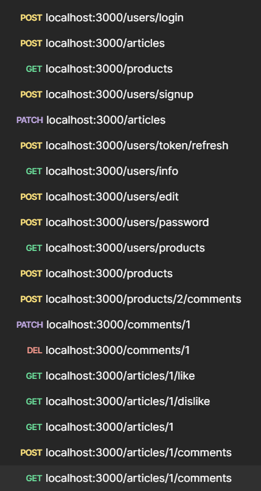

# 스프린트 미션 4

## 미션 목표

주어진 기본 요구사항과 심화 요구사항을 구현하였습니다.  

 
스프린트 미션 3을 기반으로 한 목표이기 때문에, 대표적인 몇 가지 API들을 아이디를 바꿔가며 postman을 통해 테스트했습니다. 
모든 케이스를 테스트하진 않았기 때문에 발견하지 못한 버그가 남아있을 수 있습니다.

## 수정사항

### 외부 종속성

수행 도중 사용한 라이브러리를 일부 변경하였습니다. npm install이 필요합니다.

### MVC

미션 목표에는 기재되어 있지 않지만, 강사님께서 지시하신 MVC 패턴을 준수하도록 하였습니다.

- DB 접근은 Model(Repository)에서만 진행합니다.
- 모델에의 접근은 Service를 통해서만 가능합니다.
- 복수의 테이블에 접근하기 위해서는 복수의 Service를 import합니다.

### 명세

스프린트 미션 3의 모범 답안을 기준으로 진행하기 때문에 기본적인 클라이언트와의 통신은 기존 방식대로 진행되어야 하지만, 편의를 위해 일부 명세를 변경하였습니다.

- 몇몇 API의 엔드포인트 url을 변경했습니다. (/token/refresh 등)
- 스프린트 미션 4에서 추가된 기능들에 대한 클라이언트의 요청 JSON 양식을 임의로 설정했습니다.

### 파일, 변수명

마찬가지로 편의와 코드의 통일을 위해 일부 파일이나 변수의 이름을 변경하였습니다.

- lib와 config와 관련된 폴더 구조를 변경하였습니다.
- Controller나 Service 등 파일명의 앞부분을 단수로 변경하였습니다.

### 로직

스프린트 미션 4의 목표 달성 이외에 추가적으로 로직을 수정하였습니다.

- 응답 실패 상황을 위해 db에서의 constraint 혹은 이와 유사한 경우에 대해 필요했던 검증 로직을 제거했습니다. 
  예를 들어 create의 경우, 이미 unique한 데이터가 존재할 때 이것을 미리 검사하고 알맞은 실패 응답을 보내지 않고, prisma에서 constraint 검사를 통해 자동으로 생성되는 Prisma Error를 errorController에서 처리하는 방법으로 변경하였습니다. 이를 통해 DB 접근을 줄이는 것이 목적입니다.
- 기존의 이미지 타입 검증은 공격자의 수정을 통해 무력화 될 가능성이 있기 때문에 실제 바이너리를 읽어서 검증하는 방법으로 변경하였습니다. 이 방식 역시 한계점이 존재하지만 기존 프로젝트에서 사용하였고 조금은 더 나은 방법이라고 보았기 때문입니다.

### 그외

- 목표 달성을 위해 User 모델에 refreshToken을 추가하고 Like 모델을 생성했습니다.
- .env에 JWT_SECRET를 추가했습니다.
- 이미지 업로드 및 라우팅에 사용되는 환경변수 STATIC_PATH, PUBLIC_PATH가 활용되는 부분을 수정했습니다.
