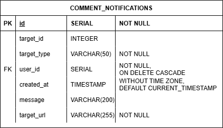

# ERD

설계 과정에서 몇 가지 고민점이 있었습니다.

## Extended Entity-Relationship (EER) Model

유저의 인증 방식을 별도의 테이블로 분리하고, 각 방식에 따라 관련 데이터를 다시 분리된 테이블에 저장하는 식으로 설계했습니다. 이 과정에서 기존 방법으로는 표현에 한계를 느껴 처음엔 아래와 같이 표현했습니다.

하지만 DB에서 트리거나 CHECK 등을 통해 제약 조건을 구현하는 것은 매 로그인마다 발생할 로직을 무겁게 만든다고 생각하여 제외하였습니다.

## Notificaions

### Relation

하나의 댓글에 대해 하나의 알림이 생성되고, 알림이 삭제되어도 댓글은 남아있어야 합니다.
추가적으로 댓글이 삭제되어도 알림은 남아있어야 한다고 가정했습니다. 자신이 등록한 상품에 대해 누군가가 댓글을 달았다가 삭제해도, 물건을 판매하려는 상황이라면 그 사실을 알고 싶을 것이라고 생각하기 때문입니다.
그래서 처음엔 아래와 같이 설계했습니다.

하지만 draw.io툴에서 위 관계선을 기본적으로 제공하지 않았고, 뭔가 이유가 있을 것이라고 생각했습니다. 검색해보니 매우 무거운 데이터 혹은 보안 등의 정책적인 이유 이외에는 일반적으로 잘 사용되지 않는다고 나타났습니다.
정책에 따라서는 해당 상품을 찜한 유저에게도 알림이 갈 수 있다고 생각해서 1(Mandatory):N(Optional)관계로 변경하도록 하였습니다.

### 통합된 Notifications Entity

Figma에는 상품에 대한 알림만 나와있지만, 게시글에 대한 알림 기능도 구현되었다고 가정했습니다.
처음에는 아래와 같이 구상했습니다.

상품과 게시글의 댓글과 알림의 구조가 같아 하나로 통합하는 것에 대해 고려해보았습니다. 이를 위해서는 FK제약을 제거하고 연결될 Entity의 종류(상품, 게시글)와 해당 id를 string으로 포함하는 방법을 생각했습니다.
댓글의 경우, 모든 댓글은 상품 혹은 게시글을 참조하고 있으며 삭제 시 함께 삭제되기 때문에 부적절하다고 판단했습니다. ON DELETE CASCADE를 구현하기 위해 댓글에서 상품, 게시글을 Nullable로 참조할 수도 있지만, 상품과 게시글 이외에 새로운 타입이 추가될 때마다 테이블 구조의 변경이 필요합니다. 때문에 이 경우는 제외하였습니다. 
알림의 경우 댓글이 삭제되어도 연결이 끊어진 상태로 존재할 수 있기 때문에 괜찮은 방법이라고 생각했습니다. 

- 알림을 눌렀을 때, 해당 상품 혹은 게시글로 이동하는 기능이 있다고 가정했습니다. 지금처럼 FK가 없는 상황에서 해당 기능을 위해서는 알림 생성 시 알맞은 url을 추가하여 해당 페이지로 이동하게 해야 합니다. 상품 혹은 댓글이 삭제되어 해당 페이지가 없어도 기존 로직처럼 원본 댓글이 삭제되었다고 안내할 수 있습니다.
- 알림 생성 시 target_id 검증으로 인한 추가적인 비동기 작업을 걱정했습니다. 하지만 알림은 댓글 작성 시 서버에서 생성되기 때문에 아래와 같은 순서로 진행한다면 유저의 대기시간도 유지하면서 기능을 수행할 수 있을 것이라고 생각했습니다. 또한 target_id는 댓글 작성 과정에서 이미 검증된 상태이기 때문에 추가적인 작업은 없어도 될 것입니다.

1. 댓글 생성 성공
2. 알림 생성 작업 진행(await 없이)
3. 댓글 생성 성공 응답 반환

최종적으로 알림은 위와 같은 구조로 구성하였습니다. 여기서 target_url은 (target_id & target_type)이라는 Non-prime 속성에 종속되어 정규화에 위배됩니다. 하지만 알림은 가능한 실시간에 가깝게 업데이트 되는 만큼 잦은 select가 발생할 것이고, 상품과 게시글에 대한 알림이 분리되어 있다면, 또 새로운 타입이 추가된다면 JOIN비용이 커질 것이라고 생각했습니다. 그래서 비정규화된 상태로 설계했습니다.

## 좋아요(찜)

알림과 달리 좋아요는 댓글과 같이 상품과 게시글에 따라 테이블을 분리하였습니다. 중고거래에서의 좋아요는 가격변동 확인이나 추후 구매 등을 위한 찜에 가깝지만, 게시글에서의 좋아요는 단순한 추천에 그치기 때문입니다. 따라서 자신이 좋아요를 표시한 상품, 게시글을 한번에 가져오는 기능은 잘 수행되지 않을 것입니다.

## 이미지 테이블

주어진 Figma에서는 상품 등록 시 단 하나의 이미지만을 업로드할 수 있습니다. 현태님의 조언대로 일반적으로 이런 상황은 적을 것이기 때문에 게시글에 대해서는 별도의 이미지 테이블을 생성했습니다.

## ERD

# 생성 SQL

작성한 생성 SQL을 토대로 생성된 ERD입니다

